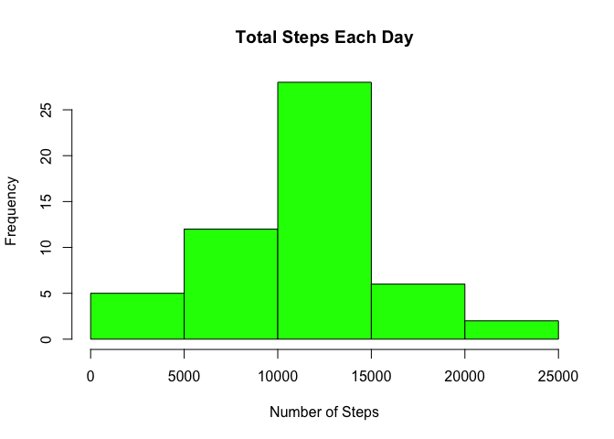

## Loading and preprocessing the data


```r
if (!file.exists("activity.csv") )
{
  dlurl <- 'http://d396qusza40orc.cloudfront.net/repdata%2Fdata%2Factivity.zip'  
  download.file(dlurl,destfile='repdata%2Fdata%2Factivity.zip',mode='wb')  
  unzip('repdata%2Fdata%2Factivity.zip')
}
data <- read.csv("activity.csv") 
```


## What is mean total number of steps taken per day?


```r
total_steps <- aggregate(steps ~ date, data, sum)
hist(total_steps$steps, main = paste("Total Steps Each Day"), col="green",xlab="Number of Steps")
```

<!-- -->

```r
Mean <- mean(total_steps$steps)
Mean
```

```
## [1] 10766.19
```

```r
Median <- median(total_steps$steps)
Median
```

```
## [1] 10765
```

The mean number of steps is 10765 and the median number of steps is 10765.

## What is the average daily activity pattern?


```r
steps_interval <- aggregate(steps ~ interval, data, mean)
plot(steps_interval$interval,steps_interval$steps, type="l", xlab="Interval", ylab="Number of Steps",main="Average Number of Steps per Day by Interval")
```

<!-- -->

```r
max_interval <- steps_interval[which.max(steps_interval$steps),1]
max_interval
```

```
## [1] 835
```

The interval with most average steps is 835.

## Imputing missing values


```r
Inc <- sum(!complete.cases(data))
Inc
```

```
## [1] 2304
```

There are 2304 missing values.


```r
c1 <- rgb(173,216,230,max = 255, alpha = 80, names = "lt.blue")
c2 <- rgb(255,192,203, max = 255, alpha = 80, names = "lt.pink")
imputed <- ifelse(is.na(data$steps),steps_interval[,"steps"],data[,"steps"])
data2 <- data.frame(data[,-1],steps=imputed)
steps <- aggregate(steps ~ date, data = data2, sum, na.rm = TRUE)
hist(steps$steps, main = paste("Total Steps Each Day"), col=c1, xlab="Number of Steps")
#Create Histogram to show difference. 
hist(total_steps$steps, main = paste("Total Steps Each Day"), col=c2, xlab="Number of Steps", add=T)
legend("topright", c("Imputed", "Non-imputed"), col=c("Light Blue", "Light Pink"), lwd=10)
```

<!-- -->

```r
mean_total <- mean(total_steps$steps)
mean_total
```

```
## [1] 10766.19
```

```r
median_total <- median(total_steps$steps)
median_total
```

```
## [1] 10765
```

```r
diff_mean <- mean_total - Mean
diff_mean
```

```
## [1] 0
```

```r
diff_median <- median_total - Median
diff_median
```

```
## [1] 0
```

The difference is very minimal.

## Are there differences in activity patterns between weekdays and weekends?


```r
weekdays <- c("Monday", "Tuesday", "Wednesday", "Thursday", 
              "Friday")
data2$dow = as.factor(ifelse(weekdays(as.Date(data2$date)) %in% weekdays,
                             "Weekday", "Weekend"))
total_steps2 <- aggregate(steps ~ interval + dow, data2, mean)
library(lattice)
xyplot(total_steps2$steps ~ total_steps2$interval|total_steps2$dow,
       main="Average Steps per Day by Interval",xlab="Interval", ylab="Steps",
       layout=c(1,2), type="l")
```

<!-- -->

There are peaks during earlier times on weekdays. This could possibly be because people are going to work whereas on weekends they don't.
